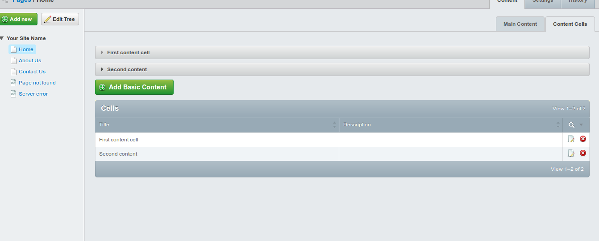
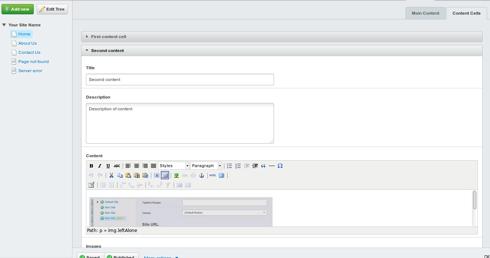
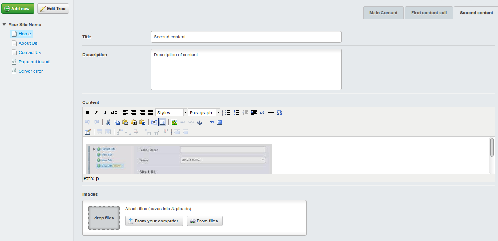

# Multi Record Editing field

A field for editing multiple fields in a single editing interface. 

## Requirements

 * SilverStripe ^3.2
 
## Installation


## License
See [License](license.md)

## Problem being solved

In some sites, it is desirable to remove some complexity from the editing 
process around managing objects related to pages, and only allow editing of
those objects instead of full control over adding and removing them. 

By making a gridfield available for power users to add, re-order and remove 
objects, and then presenting just the editable fields for the objects to 
content, both usage models can be catered for. 


## Documentation
 
```
private static $has_many = array('Cells', 'BasicContent');

$editor = MultiRecordEditingField::create('ContentCellEditor', 'Content Cells', $this->Cells());
$fields->addFieldToTab('Root.ContentCells', $editor);
```


## Example configuration (optional)

```php
class Page extends SiteTree {
	
	private static $has_many = array(
        'Cells'      => 'BasicContent',
    );

    public function getCMSFields()
    {
        $fields = parent::getCMSFields();

        $editor = MultiRecordEditingField::create('ContentCellEditor', 'Content Cells', $this->Cells());
        $fields->addFieldToTab('Root.ContentCells', $editor);

        if (Permission::check('ADMIN')) {
            $config = GridFieldConfig_RecordEditor::create();
            $grid = GridField::create('Cells', 'Cells', $this->Cells(), $config);
            $fields->addFieldToTab('Root.ContentCells', $grid);
        }

        return $fields;
    }
}

class Page_Controller extends ContentController {}


class BasicContent extends DataObject
{
    private static $db = array(
        'Title'     => 'Varchar(255)',
        'Description'   => 'Text',
        'Content'       => 'HTMLText',
    );

    private static $has_one = array(
        'Parent'        => 'Page',
    );

    private static $many_many = array(
        'Images'        => 'Image',
    );

    public function getCMSFields()
    {
        $fields = parent::getCMSFields();

        $uploadField = UploadField::create('Images', 'Images', $this->Images());
        $uploadField->setAllowedFileCategories('image');
        $fields->replaceField('Images', $uploadField);

        return $fields;
    }
}

```

Alternatively, the top level items may be inserted on separate tabs

```php

		// in Page::getCMSFields()
		$i = 0;
        foreach ($this->Cells() as $cell) {
            $editor = MultiRecordEditingField::create('ContentCellEditor' . (++$i), $cell->Title, ArrayList::create(array($cell)));
            $editor->setUseToggles(false);
            $fields->addFieldToTab('Root.' . $cell->Title, $editor);
        }
```

**Multi-edit-ception?**

The `MultiRecordEditingField` supports nesting of other 
`MultiRecordEditingField`s. When the field detects a `MultiRecordEditingField` 
in the set of fields to edit, that field is added as another nested toggle 
field inside the parent set of fields for editing. 

**Custom fields**

The `MultiRecordEditingField` uses the output of `getCMSFields` when building
the fieldlist used for editing. To provide an alternate set of fields, define
a `multiEditFields` method that returns a `FieldList` object. 

Additionally, the `MultiRecordEditingField` calls the `updateMultiEditFields` 
extension hook on the _record_ being edited to allow extensions a chance to
change the fields. 

## Screenshots

The above allows admin users to control what elements are available in the page
for editing.



While content authors are provided an in-page view for editing items. 



Or set on different tabs.



## Maintainers

* Marcus Nyeholt <marcus@silverstripe.com.au>
 
## Bugtracker
